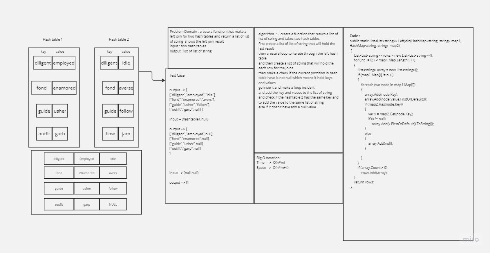
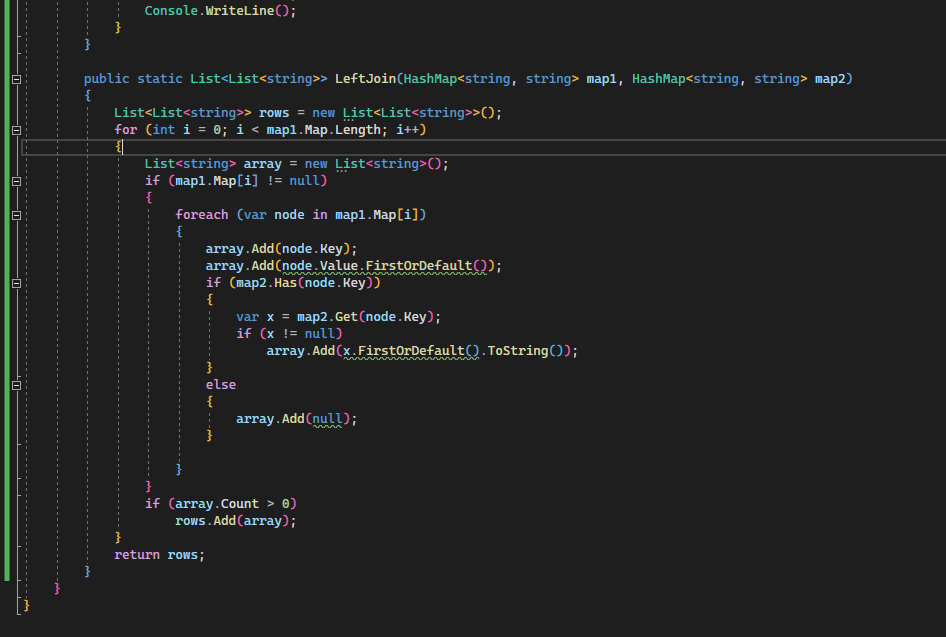
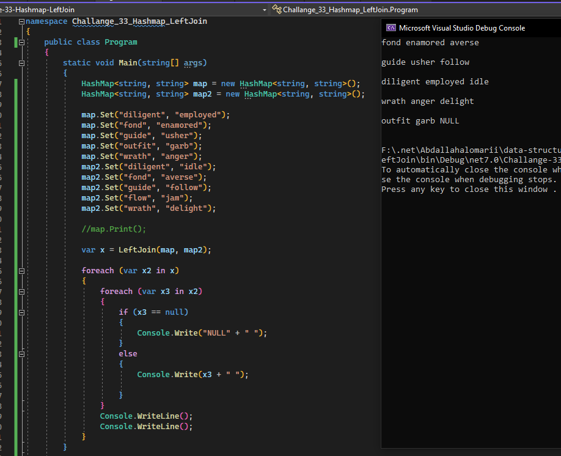

## challange 33  Left join two hash tables 

### whiteboard 

- 

### approach & efficiency

-  function implements a left join operation between two HashMaps.
-  It iterates through the keys in the first HashMap (map1) and, for each key, retrieves the corresponding values from both map1 and map2. It then constructs rows of data by combining these values.
-  Here are some observations about the approach:
    - The function follows a straightforward approach to perform a left join operation between two HashMaps.
    - It handles cases where keys exist only in map1 or are common to both maps.

- #### Total time complexity :
O(n) (looping through map1) * O(m)(iterating through key-value pairs in each element of map1) * O(1) (lookup and retrieval in map2) = O(n * m)

- #### Space Complexity : 
Total space complexity = O(n * m) (for rows) + O(k) (for array) + O(1) (for temporary variables) = O(n * m + k)

### Code 

- 
- 