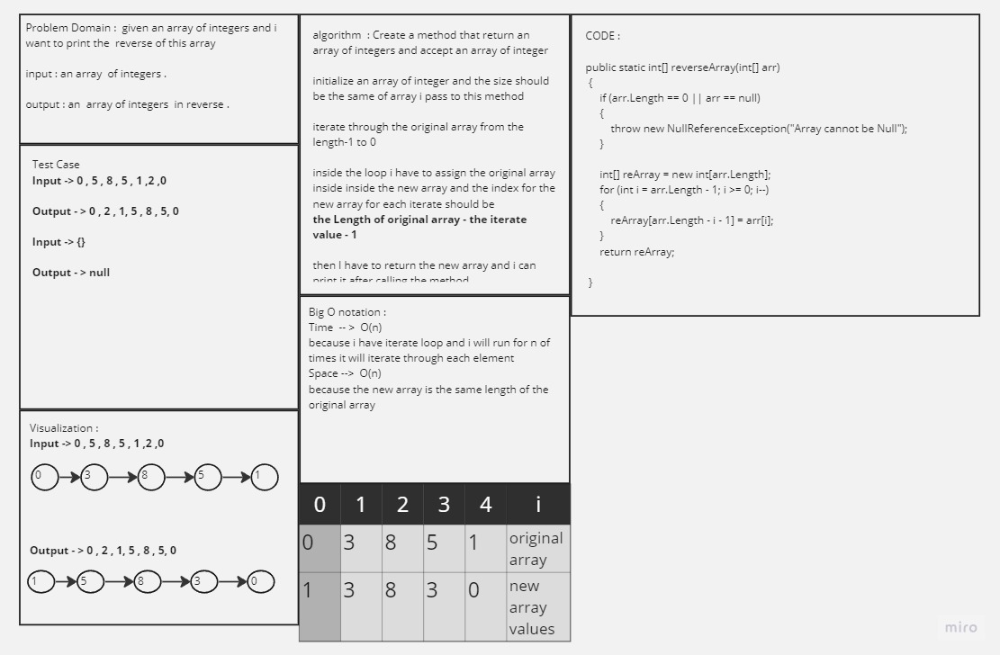
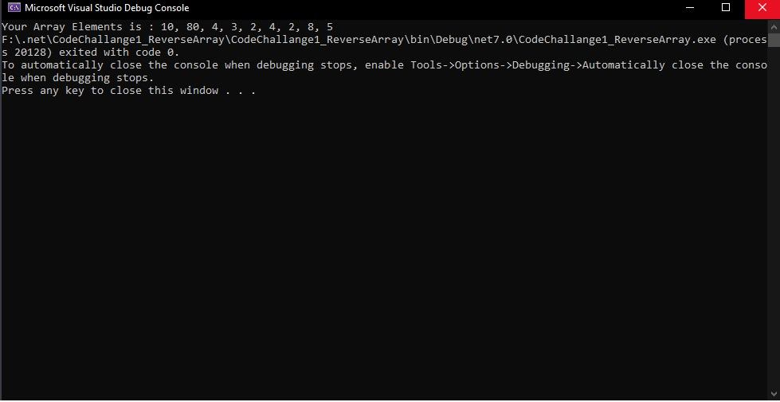
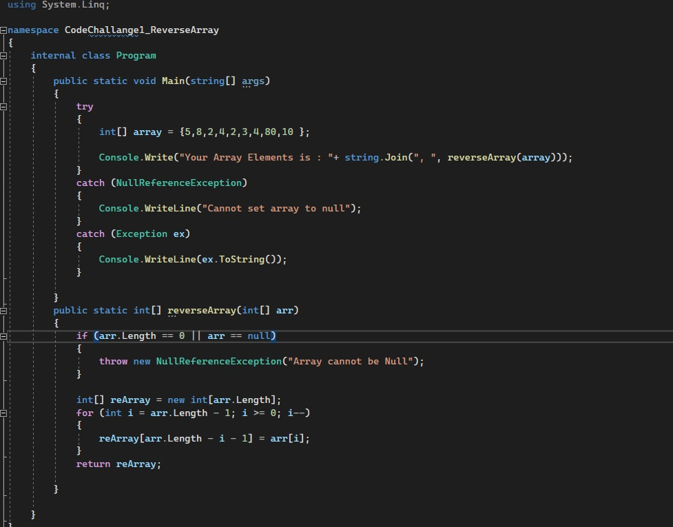
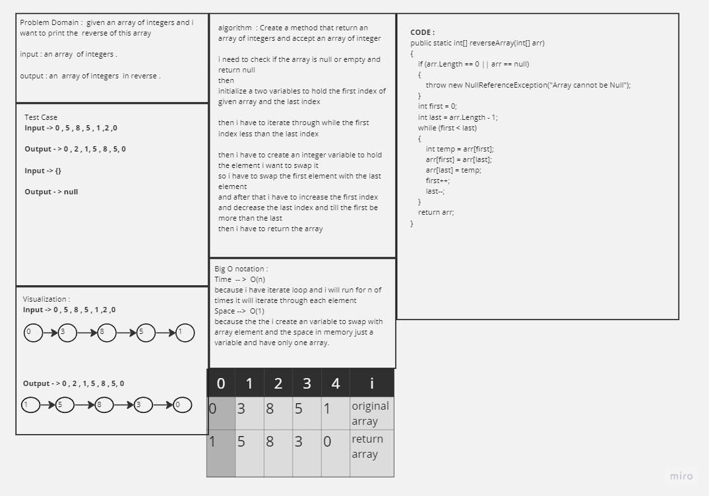
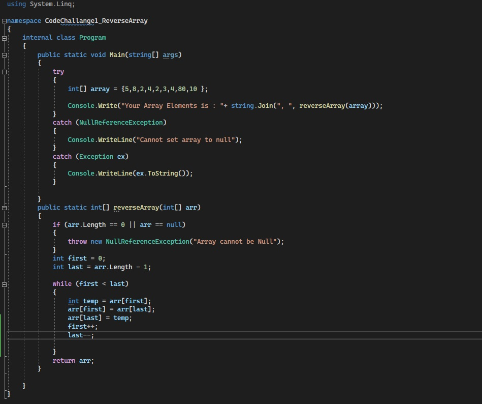

## Challange 01 reverse Array 

## reversed array 

- ### WhiteBoard Title 
    
    - 

- ### Approach & Efficiency

    - What approach did you take? Why? What is the Big O space/time for this approach

        - i take an iterations approaach to loop throug elements inside my orginal array and store them inside my new array, first i checked if the array i pass is empty or null to return null and the main should handle the expection of returning null. And iterate the array i pass and assignied the value of the original array inside the new array and the the index for the new array is original array length - the iterate number - 1 .

        - the Big O notation is for both space and time O(n).

- ### Solution

    - To run my code just copy the repo inside your vs and then open it and run directly it should give you this screen 

    - here are some screen shots for my code and my test case :

    - 

    - 

    -  

--- 
- ## Strech Goals 

- ### WhiteBoard Title 
    
    - 

- ### Approach & Efficiency

    - What approach did you take? Why? What is the Big O space/time for this approach

        - i make an iterations approaach to loop while the first index is less than the last index inside my orginal array and swap the first element with the last element and used another variabel to hold the swap and after the swap finish the first index will increase and the last index will decrease until the first index become more than the last index. and thw while stop gonna stop and it should return the same array with reversed elements.

        - the Big O notation is O(n) for the Time complexity and the space  O(1) .

- ### Solution

    - To run my code just copy the repo inside your vs and then open it and run directly it should give you this screen 

    - here are some screen shots for my code and my test case :

    - **Note** it is the same result so didn't take a new screenshots exept the solution code source.

    - 

    - 

    -  

