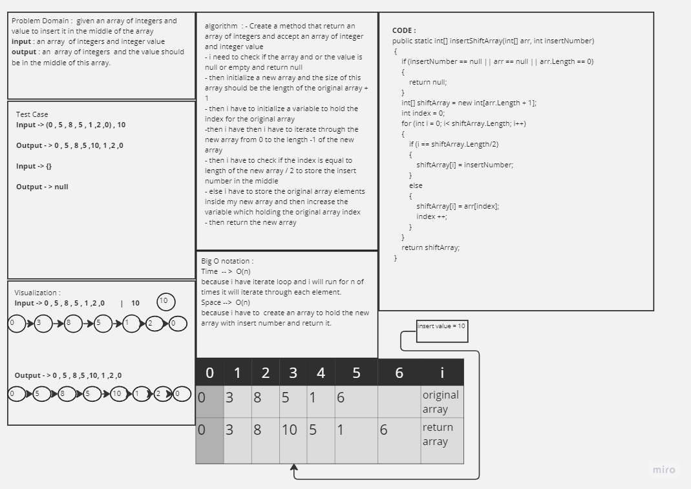
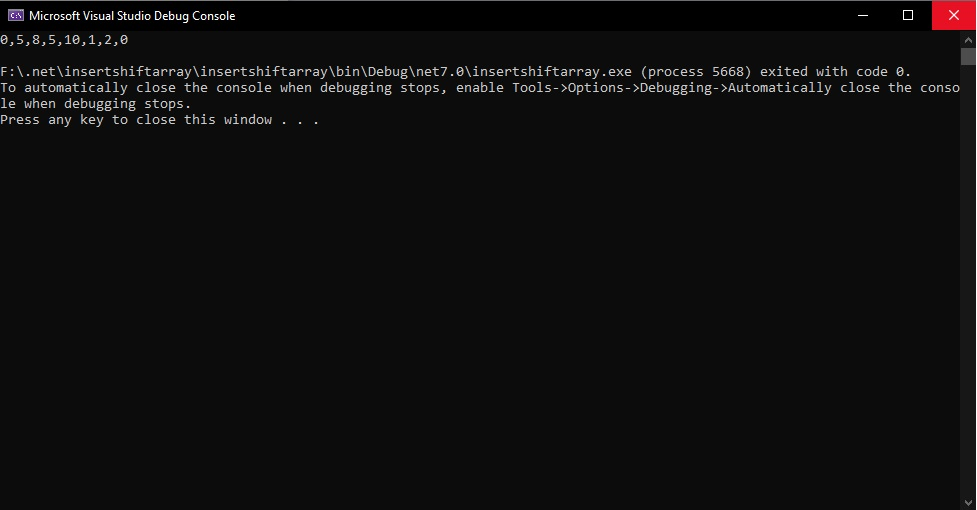
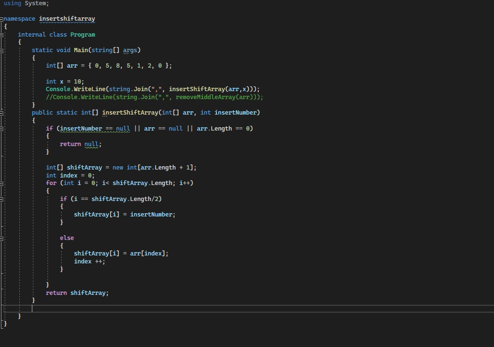
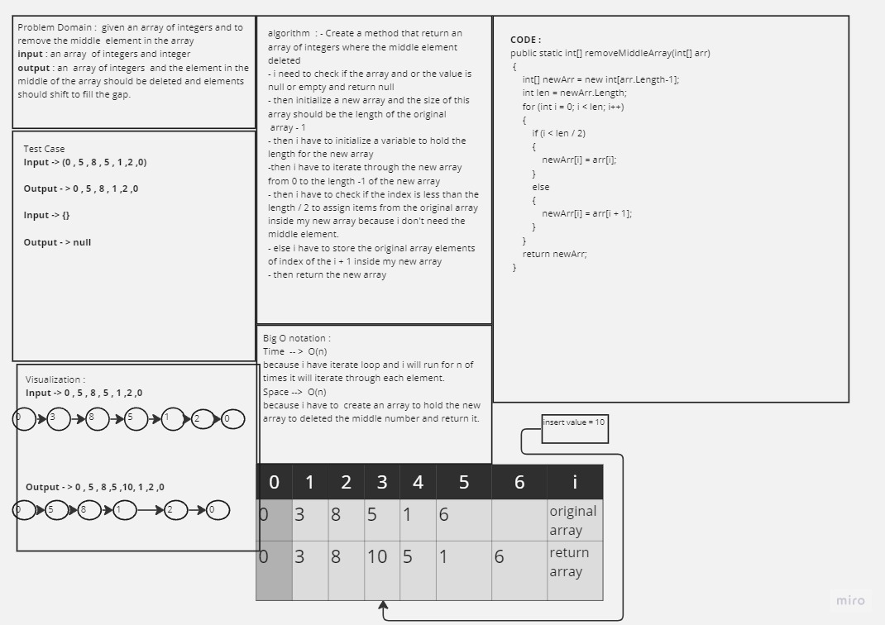
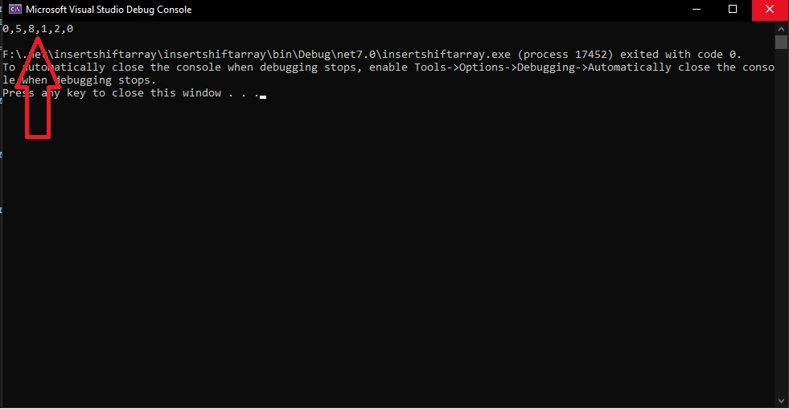
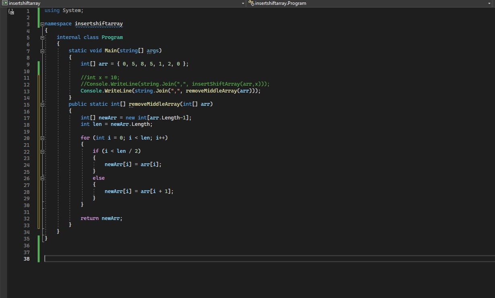

## Challange 01 reverse Array 

## Insert Shift array 

- ### WhiteBoard Title 
    
    - 

- ### Approach & Efficiency

    - What approach did you take? Why? What is the Big O space/time for this approach

        - i take an iterations approaach to loop throug elements inside my orginal array and store them inside my new array and i created also another varaiable to hold for me the i terate number for the original array beacsue the iterate will moove more than the size  of the orginal array, first i checked if the array i passed is empty or null to return null and the main should handle the expection of returning null. And then i iterate throught  the new array and checking if the the iteration number is equal to the length / 2 of the new array, then i put the value of the inerted value u passed inside my middle element of the new array,
        if it is not the middle array element, it will assign the the original array element inside my new array and to make sure i reach all elements in the orginal array and the new array i made a variable which called index to increase each time the loop iterate.  

        - the Big O notation is for both space and time O(n).

- ### Solution

    - To run my code just copy the repo inside your vs and then open it and run directly it should give you this screen 

    - here are some screen shots for my code and my test case :

    - 

    -  

--- 
- ## Strech Goals 

- ### WhiteBoard Title 
    
    - 

- ### Approach & Efficiency

    - What approach did you take? Why? What is the Big O space/time for this approach

        - i make an iterations approaach to loop thorught my new array, first i created a new array with length -1 of the original array becasue i ahve to delete element, then i create a variable to hold the length of the new array to loop thopugh it, then i make condition inside the loop if the index iam in right 
        now is less than the new array length / 2 so assign the original elements inside the new array, else if it the iteration number become more than the half of the length of the array so assign the index + 1 of the original array inside the new array and finally return the new array.

        - the Big O notation is O(n) for the Time complexity and the space  O(n) .

- ### Solution

    - To run my code just copy the repo inside your vs and then open it and run directly it should give you this screen 

    - here are some screen shots for my code and my test case :

    
    - 

    -  

