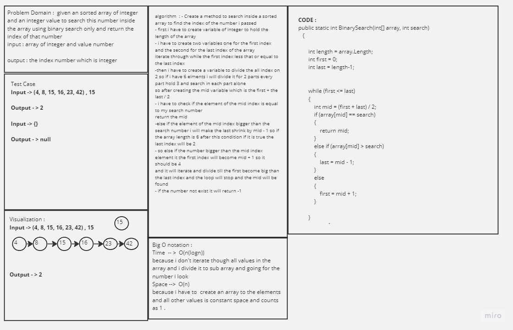
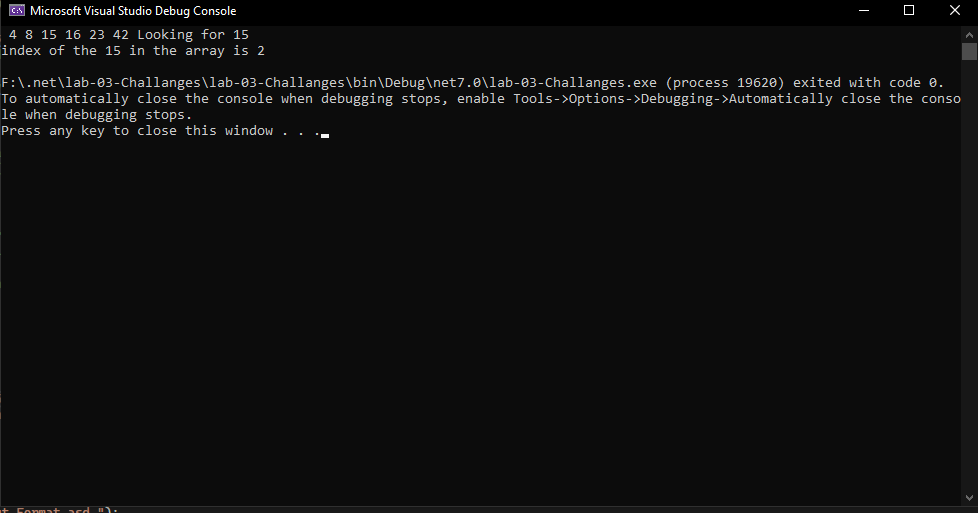

## Challange 01 reverse Array 

## Insert Shift array 

- ### WhiteBoard Title 
    
    - 

- ### Approach & Efficiency

    - What approach did you take? Why? What is the Big O space/time for this approach

        - i take an divide iteration approaach to loop through my first index to last index 
        and check every time if the mid index of element is equal to the number i looking for 
        if it is not please go and check if the element of the mid index is bigger than the number i want to search if it is go and make the last = mid -1 
        and if the element of the mid index is less than the number go and make the first = mid + 1 and, keep iterate till the first become bigger than the last index 
        if the number i looking for is not found return -1
        - the Big O notation is for both space and time O(n).

- ### Solution

    - here are some screen shots for my code :

    - 

    -  

