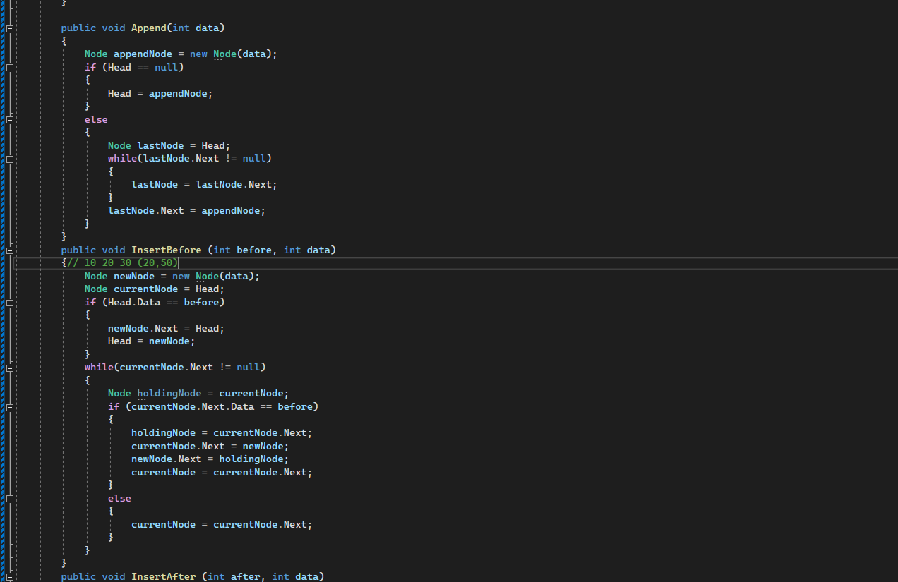
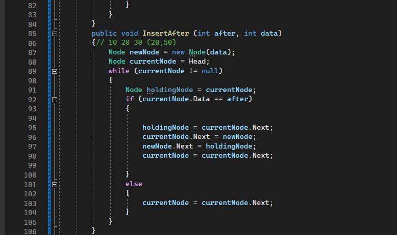
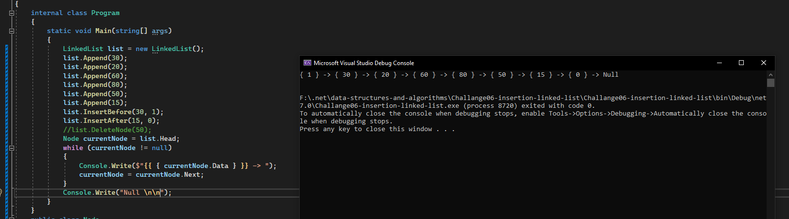
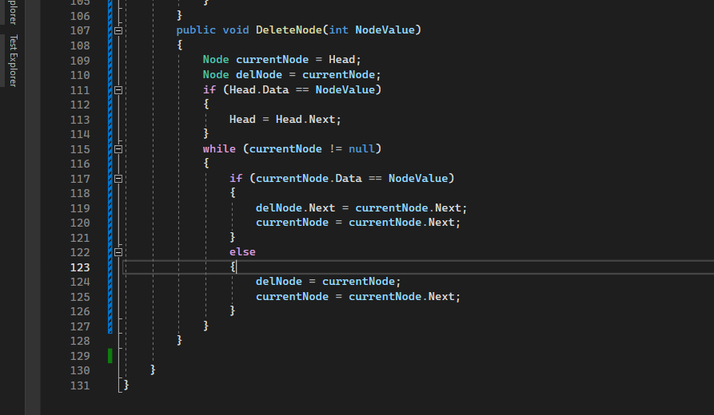

# Linked List CodeChallange 06

- ### Approach & Efficiency

    - What approach did you take? Why? What is the Big O space/time for this approach

        - I take a signle linked list approach in insert after and before the specific node i creating node to hold the next node and then do the swap and this one 
        has Time Complixity of O(n) becuase i have to iterate through the whole nodes in the list, while the space complixity is O(1), and the Append metohd as the same but i created node to hold the last
        node in the linked list and it always take the whole list from the head to the end and i iterate through it and if the next of this node is null this means i have to add node so insert node here.

        - so the summary of the big O notation is O(n) for the 3 methods in the worst case and the space time is also O(1) for all methods

- ### Solution

    - here are some screen shots for my code :camera:

    - 
    -  
    - 

    --- 

    # Stretch Goal Delete Node :x:

- ### Approach & Efficiency 

    - What approach did you take? Why? What is the Big O space/time for this approach

        - well here in the delete node method i solve it by thinking what to do to remove the node from the linked list 
        so i decided to make a new node it has the same value of the current node and if the data i have equal the data i passed
        so we need to delete this node by the node i created the next of it will be the next of the current and in this way
        the node will skip one node which i curenntly on it 

        - the Big O notaion is O(n) and the space is O(1)

- ### Solution

    - here are some screen shots for my code :camera:

    - 
    - 

    --- 