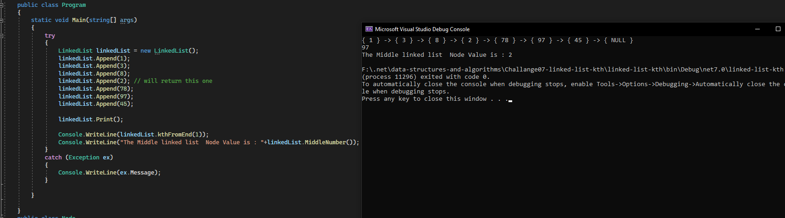

# Linked List CodeChallange 07 
## Kth from the End

- ### WhiteBoard 
- 

- ### Approach & Efficiency

    - What approach did you take? Why? What is the Big O space/time for this approach

        - I take a signle linked list approach to loop thorugh the linked list values and get the length, and another loop to check if (the length of the 
        linked list - the counter equal to k) and the counter here start from 0 and increase with the second loop lets say we pass a 0 
        so the 0 means it is the last index in the linked list and while the length is 3 and the counter will become 3 so 3 - 3 == 0 ? 
        yes so return this value for this node.

        - so the summary of the big O notation is O(n) for the this methods in the worst case and the space time is also O(1)

- ### Solution

    - here are some screen shots for my code :camera:

    - 
    - 

    --- 

    # Stretch Goal Middle number

- ### Approach & Efficiency 

    - What approach did you take? Why? What is the Big O space/time for this approach

        - i make the same approach looping through the linked list and to get the length of this linked list and another loop to 
        get the node value and the condition here if the length / 2 == i and the i here is the new counter start from the head 
        and increased every time i move in the linked list when the condition is true return this node value

        - the Big O notaion is O(n) and the space is O(1)

- ### Solution

    - here are some screen shots for my code :camera:

    - 
    - 

    --- 
