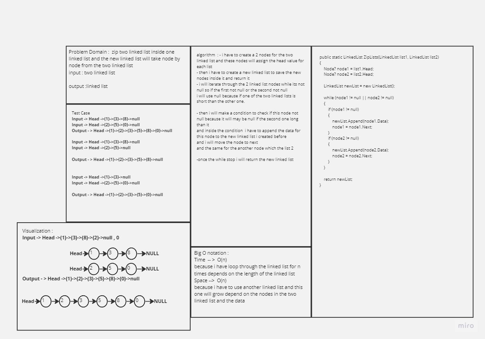
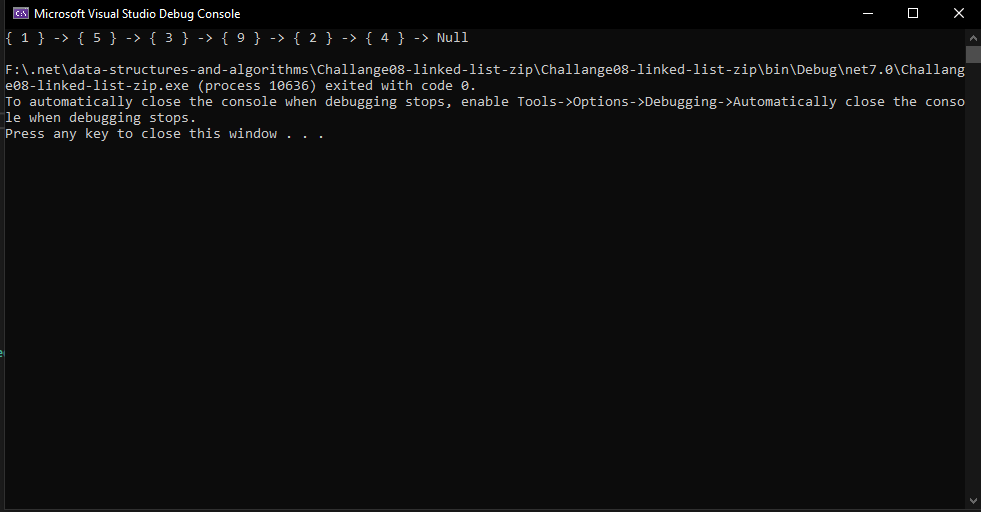
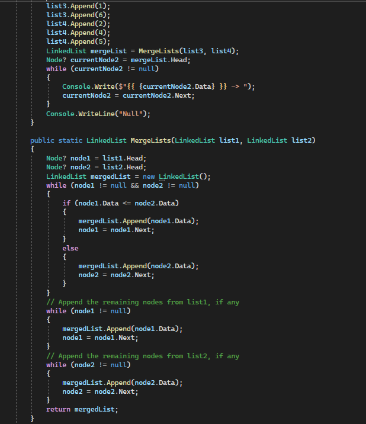
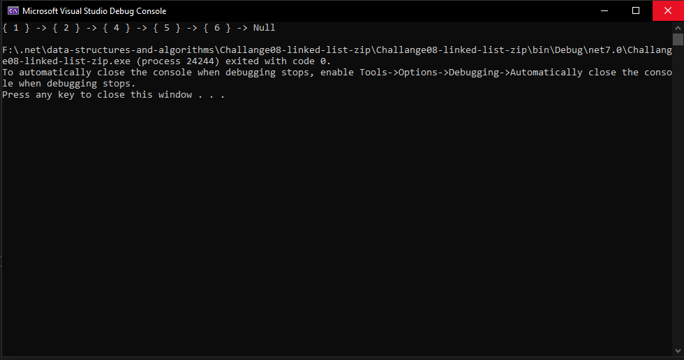
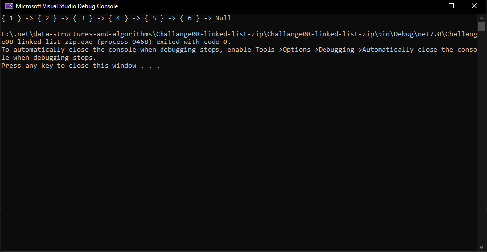

# Linked List CodeChallange 07 
## Kth from the End

- ### WhiteBoard 
- 

- ### Approach & Efficiency

    - What approach did you take? Why? What is the Big O space/time for this approach

        - I take a signle linked list approach, and creating method and sending two linked list to iterate through them while the node for each list not null and the initial node 
        will be the head of the linked lists and then i created a linked list to zip the these two linked list and i iterate through the two nodes while it is not null 
        and i used the or operator because if i have a list short than the other list and appending the data for the current node and move the node to next and finally reutrn the zip linked list

        - so the summary of the big O notation is O(n) for the this methods in the worst case and the space time is also O(n)

- ### Solution

    - here are some screen shots for my code :camera:

    - 
    - 

    --- 

    # Stretch Goal Middle number

- ### Approach & Efficiency 

    - What approach did you take? Why? What is the Big O space/time for this approach

        - I take a signle linked list approach, and creating method and sending two linked list to iterate through them while the node for each list not null and the initial node 
        will be the head of the linked lists and then i created a linked list to zip the these two linked list and i iterate through the two nodes while it is not null 
        and i used the and operator to finish iterate the same time for each list and then i checked if the data for the first node from the first list is less than or equal 
        second node data from the second list so add this data to the merge linked list  else  
        second data will be added 
        and i made another 2 while loops to iterate through the rest on nodes if we have list long than the other list and it will add the remains node to the merged linked list 
        and finally  will return the merged linked list 

        - the Big O notaion is O(n) and the space is O(1)

- ### Solution

    - here are some screen shots for my code :camera:

    - 
    - 
    - 

    --- 
