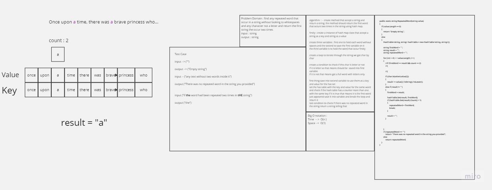
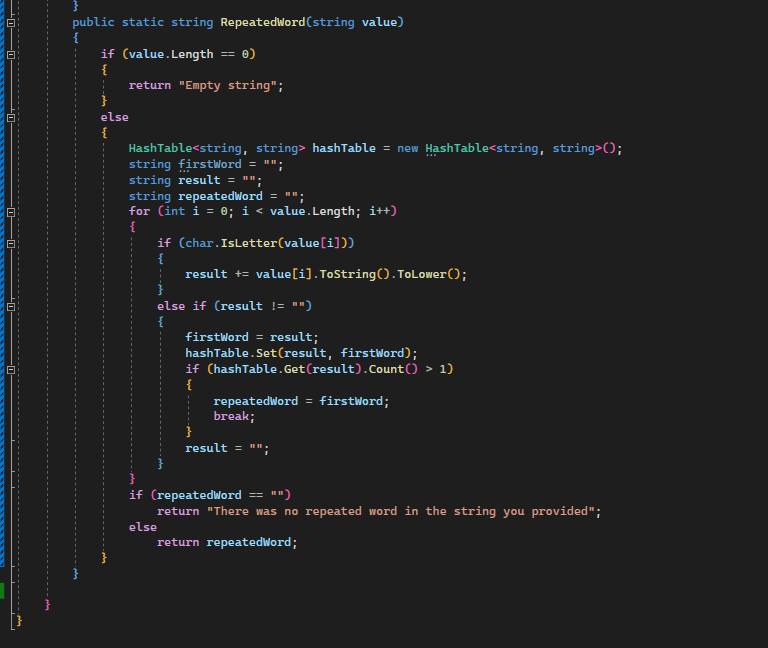
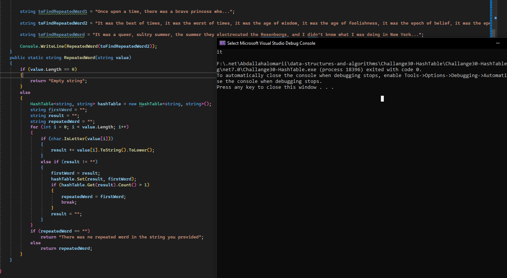

## Repeated Word using HashTable 

- ### White Board 

	

- ### Approach & Efficeiny 

	- take the loop throgh the string approach and check if the char of the index is letter or not 
	if it is true a Letter add it to temp variable else that means got the full word without any space
	so add it to the hash table as a key and value and check the hash table if it has a counter more than one with this word key 
	if it has break the loop and save the variable and return it this will gives the first word occurs 2 times in the string.

	- Time Complexity : O(n) since we have to loop through the string

	- Space Complexity : O(1) since we don't have any dynamic variabels.

- ### Code 

	- 
	- 
http://browsing-file-host/code1.png