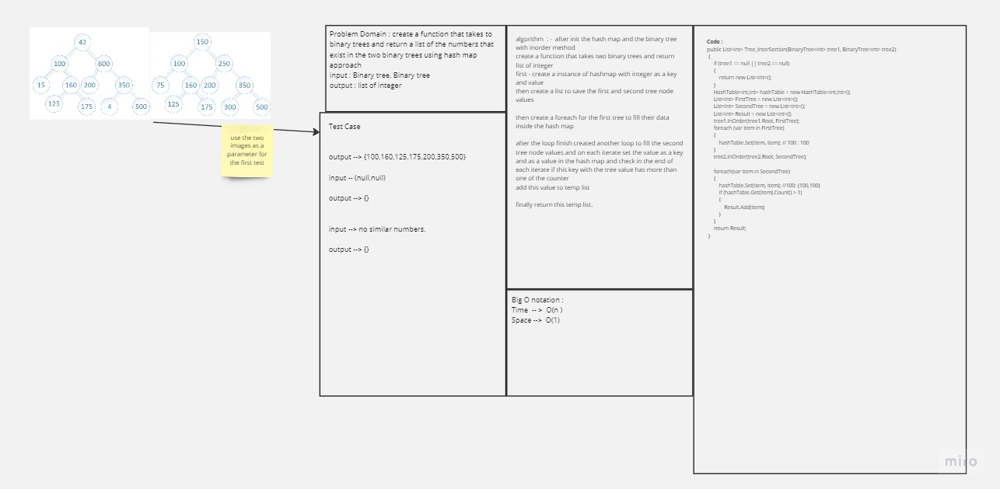
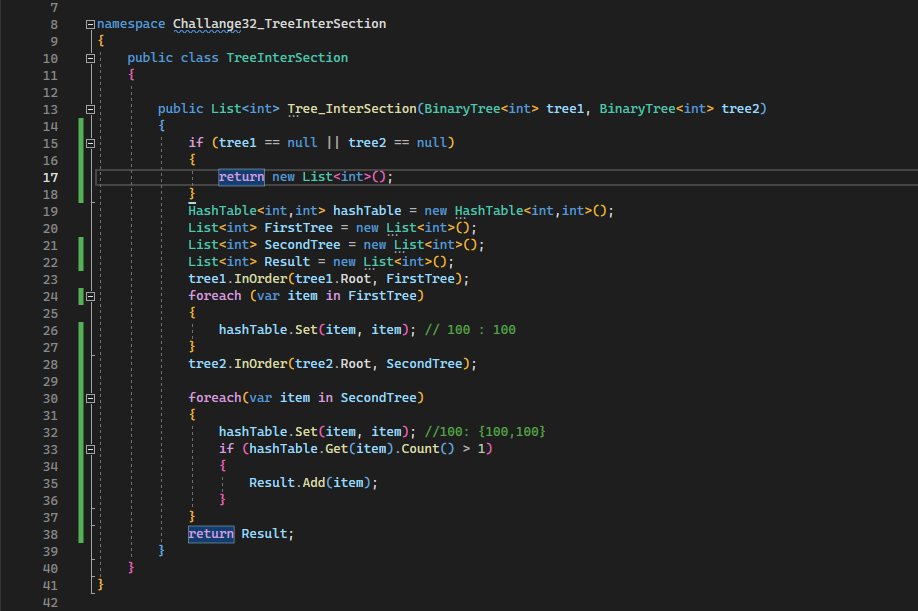
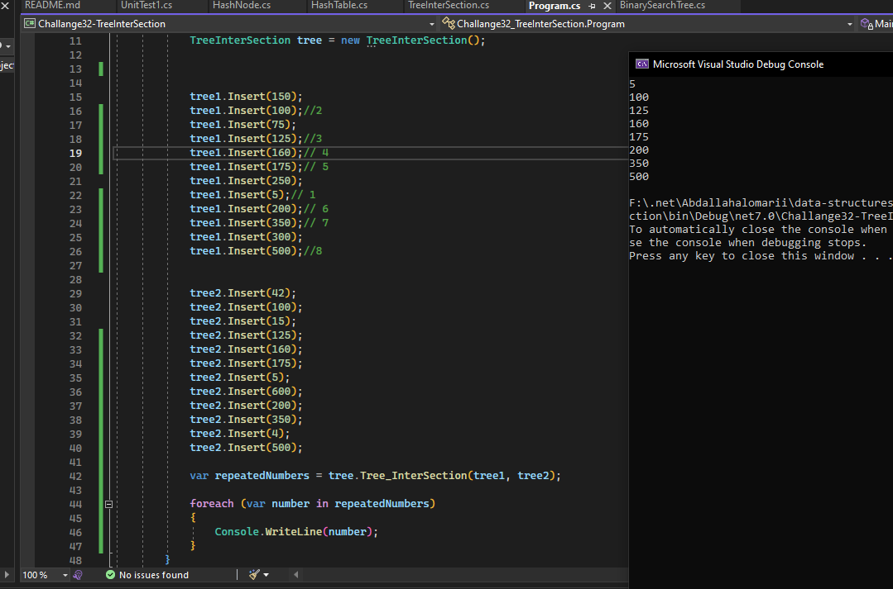

## Tree Inter Section 

- ### White Board 

	

- ### Approach & Efficeiny 

	- create a list that takes the all nodes of the binary tree in Inorder method.
	then creates a loop to fill the two trees in the hash and inside the second tree loop used a condition to check
    if the key has more than 1 value and if it is it seems that this number are found inside the two trees.

	- Time Complexity : O(n) since we have to loop through the list that we got from the trees

	- Space Complexity : O(1) since we don't have any dynamic variabels.

- ### Code 

	- 
	- 
