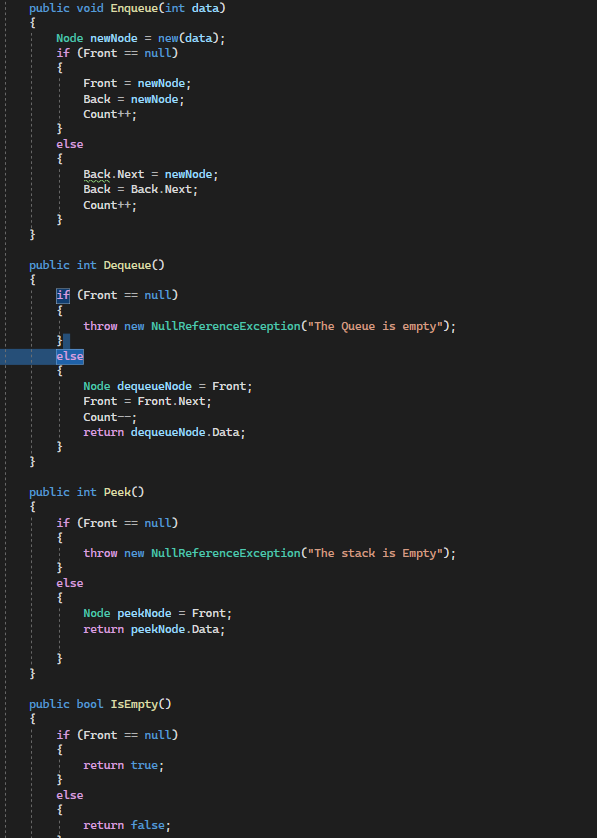

# Stack & Queue Challenge 10 
## 

- ### Approach & Efficiency

    - What approach did you take? Why? What is the Big O space/time for this approach

        - I take approch on the stack of adding a node to the first of the stack and by assign the top to first node in the stack
        each time i add a node, and for the pop method i take an approch to move the top node one time to the next node in the stack.
        and for peek just returning the top node data. and for the isempty method by returning true or false if the stack is empty will return true 
        or if it is not empty it gonna return false.

        - so the summary of the big O notation is O(1) for the this methods in the stack class and also the space will be O(1)

- ### Solution

    - here are some screen shots for my code :camera:

    - 
    - 
    - 

- # psudo queue code challenge 11 
    ### Approach & Efficiency

    - What approach did you take? Why? What is the Big O space/time for this approach

        - The Enqueue method simply pushes the new element onto stack1, as it represents the rear end of the queue.
        - The Dequeue method moves all elements from stack1 to stack2 recursively until the last element is reached. This effectively reverses the order of the elements, allowing the front element to be popped from stack2.
        - After popping the front element, the remaining elements are moved back from stack2 to stack1 in their original order.

        - so the summary of the big O notation is O(n) for the this methods and the space is seems to be O(n)

- ### Solution

    - here are some screen shots for my code :camera:

    - 
    - 

- # stack-queue-shelter CC 12 
    ### Approach & Efficiency 

     - What approach did you take? Why? What is the Big O space/time for this approach

          - For Enqueue: The Enqueue method adds an animal to the shelter. It creates a new node with the animal's data and adds it to the back of the queue.
         The time complexity of this operation is O(1) since it involves basic pointer manipulation.

        - For Dequeue: The Dequeue method removes and returns an animal from the shelter based on a preference (either "cat" or "dog").
        If the preference matches the species of the animal at the front of the queue, it is dequeued and returned.
        Otherwise, it searches for the next matching animal by traversing the queue.
        The worst-case time complexity for dequeueing is O(n).
        since it may need to traverse the entire queue to find a matching animal.

- ### Solution

    - here are some screen shots for my code :camera:

        - 
        - 
        - 
        - 

