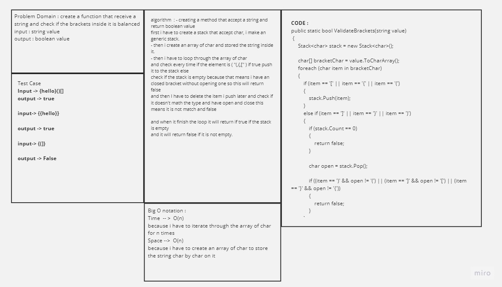
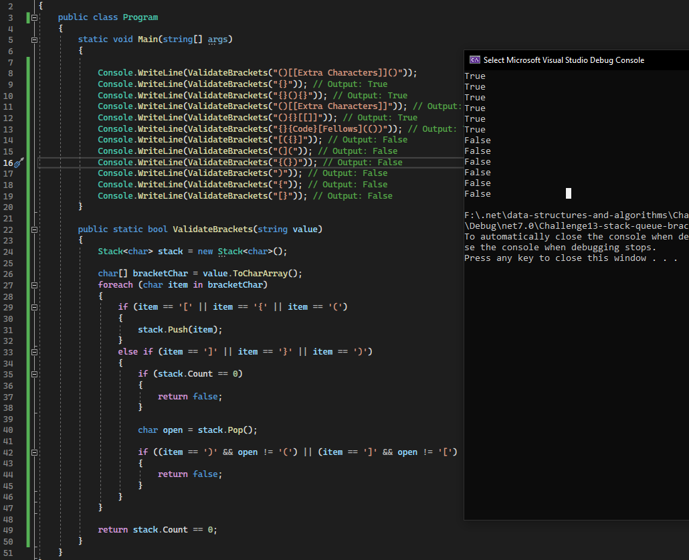

# Code Challenge 13 stack-queue brackets

- ### Whiteboard
         
    - 

- ### Approach & Efficiency

    - What approach did you take? Why? What is the Big O space/time for this approach

        - take an approach to change the string to array of char and loop though them and each time i found an open brackt it will 
        push it to the stack of char and if we found the close tag and if there is still we don't have an open tag it will return false
        else i will save the last charachter i added to the stack in new variable of char and deleted and checkig if the element im on it 
        is not type of the bracket i removed so this will be wrong and it will return false

        - so the summary of the big O notation is O(n) and also the space will be O(1)

- ### Solution

    - here are some screen shots for my code :camera:

    - 
