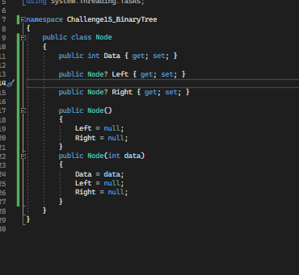
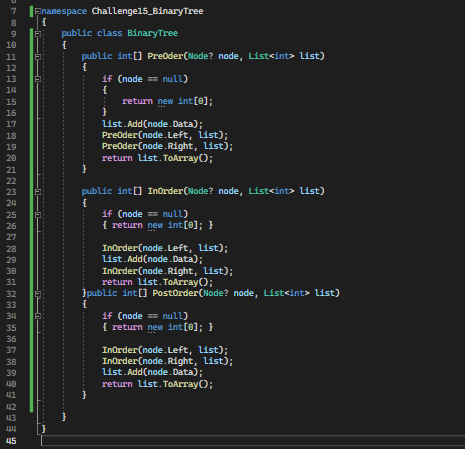
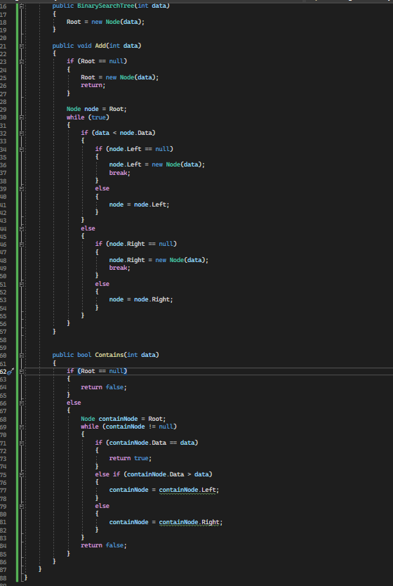

# Binary Tree Challenge

- ## Approach & Efficiency

    - Create two classes `Node` & `BinarySearchTree`, the `Node` represent the left and the right node and the data,
	and the `binarySearchTree` represent the root node and the method to add and the contains and it is extend from the 
	`BinaryTree` class.

	- the `BinaryTree` Class provides 3 methods of treversal which are the 
    	
		- inorder
		- preorder
		-postorder

	 The traversal methods has O(n) time complexity and with space Complexity of the O(1).

	 - the Add binarysearchtree method has O(log n) wrost case time complexity 
	 and with space of O(1) 
	 
	 - the contains method has a O(n) where n is the number of childs in the tree
	 and the space is also O(1)

- ## Solutions 

	- here are some screen shots for my code :camera:

		- 
		- 
		- 