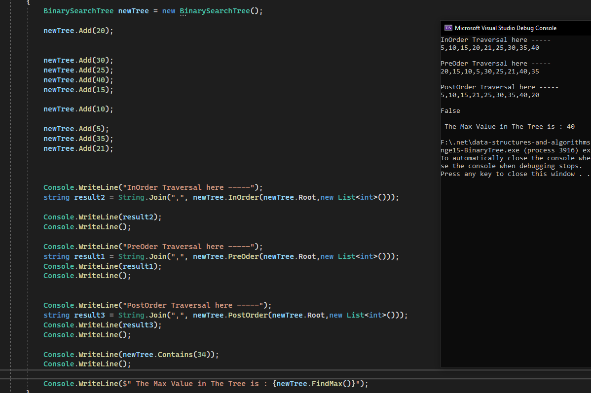
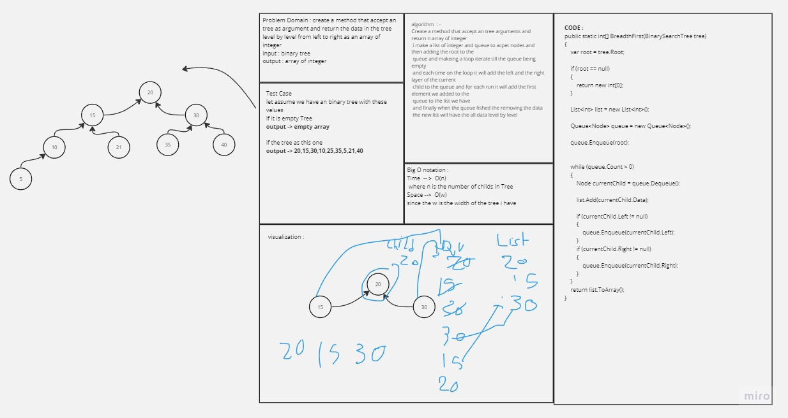
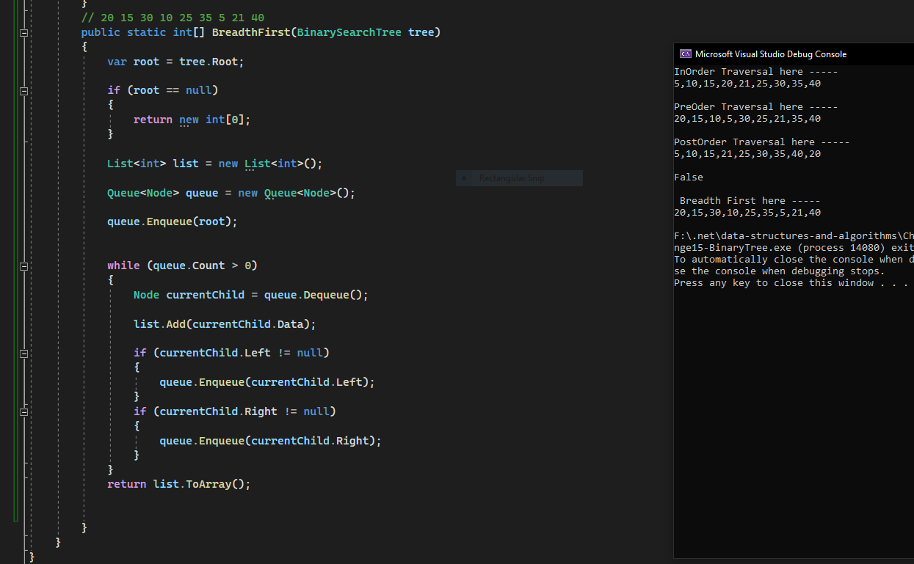

# Binary Tree Challenge

- ## Approach & Efficiency

    - Create two classes `Node` & `BinarySearchTree`, the `Node` represent the left and the right node and the data,
	and the `binarySearchTree` represent the root node and the method to add and the contains and it is extend from the 
	`BinaryTree` class.

	- the `BinaryTree` Class provides 3 methods of treversal which are the 
    	
		- inorder
		- preorder
		-postorder

	 - The traversal methods has O(n) time complexity and with space Complexity of the O(1).

	 - the Add binarysearchtree method has O(log n) wrost case time complexity 
	 and with space of O(1) 
	 
	 - the contains method has a O(n) where n is the number of childs in the tree
	 and the space is also O(1)

- ## Solutions 

	- here are some screen shots for my code :camera:

		- 
		- 
		- 

# Find max value in the Binary Tree

- ## WhiteBoard
    - 

- ## Approach & Efficiency

	- Create a method that accpet a none argument and return integer value which shoud be the 
	max value in the Binary tree 
	i created an integer value that has a min value in the memory
	and i created a node to point on the currrent node and move to right and left nodes of the tree for all child
	each time and get the value of this node and compare it with original value of the max value 
	if it is bigger it the max value will take the current node value 
	and will compare it each time and if there any value bigger than the max after any modifed 
	the max value gonna change to the new max value 

	- and it takes an O(n) where n is the number of childs in that will has a data bigger than the max 
	value and the sapce Compleixity will be O(1) since we don't have any variable shrink or expand during the run.

	- ## Solutions 

	- here are some screen shots for my code :camera:

		- 
		- 

- # Breadth first in Tree

	- ## WhiteBoard
        - 

- ## Approach & Efficiency

	- Create a method that accept an tree arguments and return n array of integer 
	i make a list of integer and queue to acpet nodes and then adding the root to the 
	queue and makeing a loop iterate till the queue being empty 
	and each time on the loop it will add the left and the right layer of the current
	child to the queue and for each run it will add the first element we added to the 
	queue to the list we have
	and finally when the queue fished the removing the data 
	the new list will have the all data level by level 

	- and it takes an O(n) where n is the number of childs in that will has a data bigger than the max 
	value
	sapce Compleixity will be O(w) where w is the width of the tree 

	- ## Solutions 

	- here are some screen shots for my code :camera:

		- 
