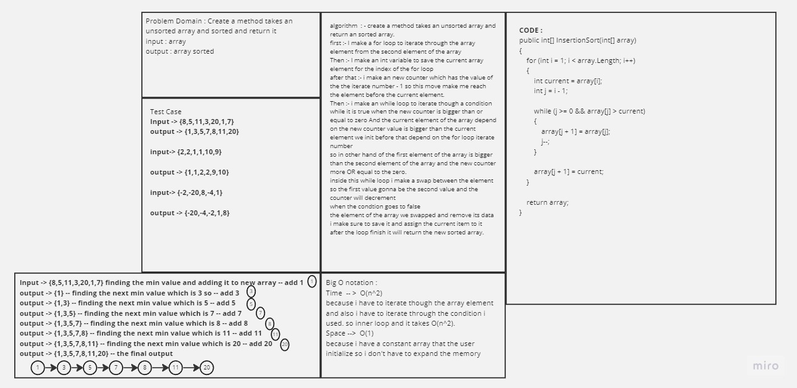
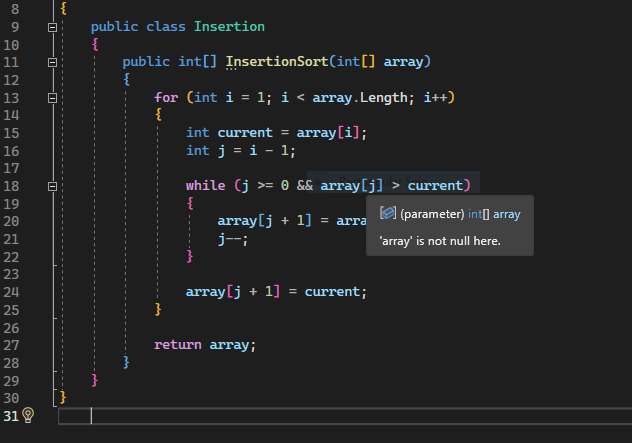
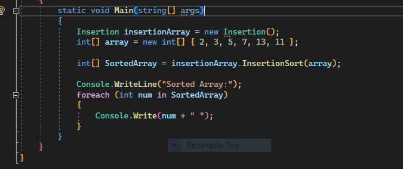
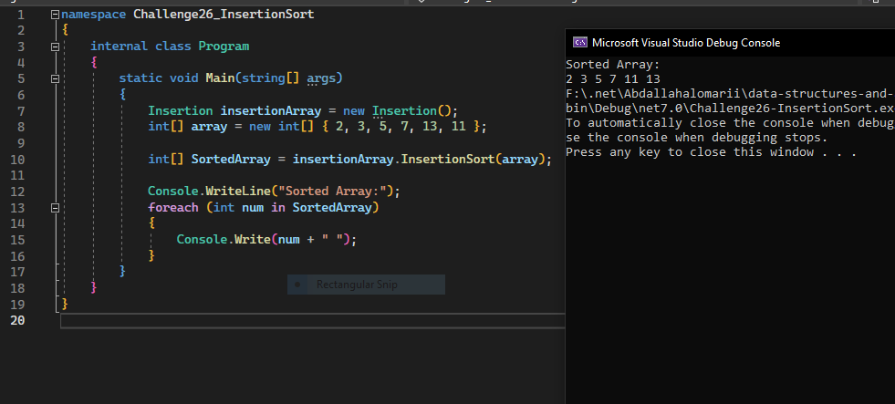

# Insertion Sort

- ## Understanding Insertion Sort Pseudocode
    - The pseudocode describes the Insertion Sort algorithm, which is used to sort an array in ascending order. It works by iteratively inserting elements from the input array into their correct positions within a sorted subarray.

    - The Insert function takes a sorted subarray and a value to insert. It first finds the correct position for the value within the sorted subarray by comparing it with the elements in the sorted subarray. Then, it shifts the elements to make space for the new value and inserts the value at the correct position.

    - The InsertionSort function initializes an empty array called sorted. It starts by adding the first element of the input array to the sorted array. Then, for each subsequent element in the input array, it uses the Insert function to insert the element into the sorted subarray.

        - Visual Step-by-Step Representation
            Let's use the sample array [8,4,23,42,16,15] and visualize the execution of the Insertion Sort algorithm:

        Initial State: sorted = []
        After adding 8: sorted = [8]
        After adding 4: sorted = [4, 8]
        After adding 23: sorted = [4, 8, 23]
        After adding 42: sorted = [4, 8, 23, 42]
        After adding 16: sorted = [4, 8, 16, 23, 42]
        After adding 15: sorted = [4, 8, 15, 16, 23, 42]

    - # WhiteBoard 
        
    - ### Effeiceny & Approach 

        -I used an inner loops to sort the array the first one is to loop though the items 
         and the second one is to compare for the maximum value and sort it in the exact place

         the Big o for this code is O(n^2) it can be O(N) if i used the divide and conqur algorihtim 
         and the space compleixity is going to be O(N)

    - ### Code Samples 
        
        - 
        - 
        - 