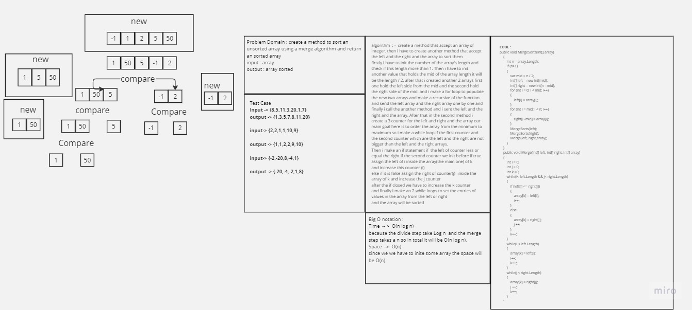
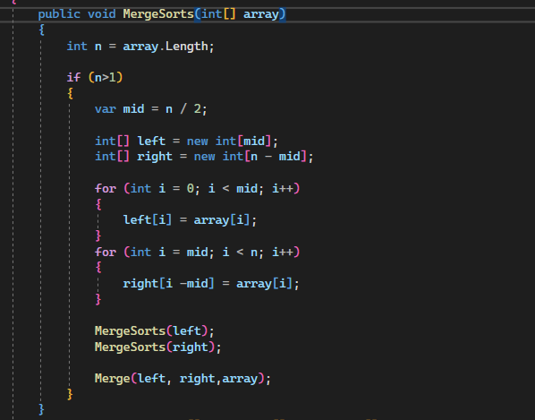
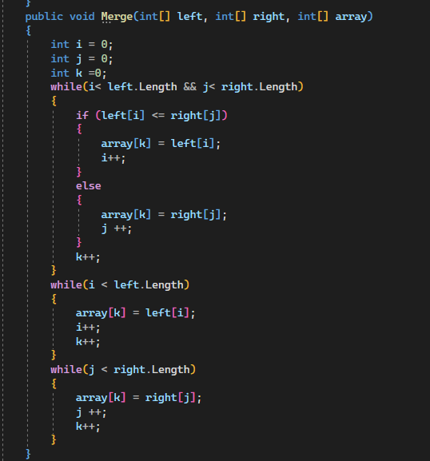
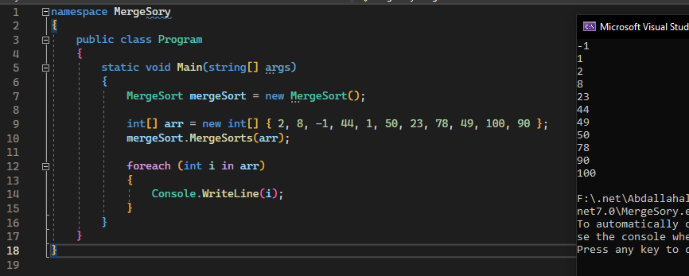

# Insertion Sort

- ## Understanding Insertion Sort Pseudocode
    
    - Merge Sort is an efficient sorting algorithm that I've been using before.
    It works by dividing the unsorted list into smaller sublists until each sublist has only one element,
    and then it merges these sublists back together in a sorted order.
    The key idea is to repeatedly divide and conquer, and it ensures that even with large datasets,
    the sorting process remains efficient. It's a bit like sorting a deck of cards by splitting it in half,
    sorting each half, and then carefully merging the sorted halves back into a single, sorted deck.
    This algorithm's efficiency and straight forward logic make it a valuable tool in programming
    and problem-solving.

- # WhiteBoard 
    
- ### Effeiceny & Approach 
        
    - Divide: The algorithm starts by dividing the input array into two equal halves
    until each subarray has only one element.
    This is a recursive process that continues until the base case is reached.
        
    - Conquer: Once we have divided the array into its smallest parts (subarrays with a single element),
    we start merging them back together in a sorted order. This is done by comparing elements
    from the left and right subarrays and placing the smaller element into the merged array.
    This process continues until we have merged all the subarrays into a single sorted array.

    - The time complexity is O(nlogn). And the space is O(n)

- ### Code Samples 
        
    - 
    - 
    - 