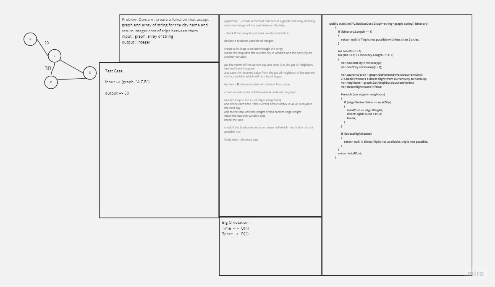

# Graph Implementaion 

### Description: 
 - This code provides a C# implementation of a graph data structure. It includes classes for Graph, Vertex, and Edge, allowing you to create and manipulate a graph with vertices and weighted edges.

### Approach & Efficiency
 - The code uses a dictionary to represent the adjacency list of the graph, where each vertex is associated with a list of edges connecting it to other vertices. The Graph class provides methods to add vertices and edges, retrieve vertices, neighbors, and the size of the graph.

   - Adding a vertex: O(1)
   - Adding an edge: O(1)
   - Retrieving vertices: O(V)
   - Retrieving neighbors: O(1)
   - Calculating the size: O(1)
   - Where V is the number of vertices in the graph.

### Solution
 -  To run the code, you can follow these steps:

    - Create a new C# console application project in your preferred development environment.

    - Copy and paste the provided code into your project files.

    - Build and run the application.
    
#### Here's an example of the code in action:


    ```

    Graph<string> graph = new Graph<string>();

    Vertex<string> a = graph.AddVertex("Amman");
    Vertex<string> b = graph.AddVertex("Irbid");
    Vertex<string> c = graph.AddVertex("Al-Karak");
    Vertex<string> d = graph.AddVertex("Aqaba");

    graph.AddEdge(a, b, 100);
    graph.AddEdge(b, c, 240);
    graph.AddEdge(c, d, 240);
    graph.AddEdge(c, a, 150);

    Console.WriteLine("Vertices in the graph:");
    foreach (var vertex in graph.GetVertices())
    {
        Console.WriteLine(vertex.Value);
    }

    Console.WriteLine("\nNeighbors of Amman:");
    var ammanNeighbors = graph.GetNeighbors(a);
    foreach (var edge in ammanNeighbors)
    {
        Console.WriteLine($"{edge.Vertex.Value} (Weight: {edge.Weight})");
    }

    Console.WriteLine("\nSize of the graph: " + graph.Size());
    ```

- This code creates a simple graph with four vertices and three weighted edges, then prints out the vertices, neighbors of the "Amman" vertex, and the size of the graph.

# Breadth First challenge 36 

## white board 

 - 

## Approach & Efficiency
 Approach:

The BFS (Breadth-First Search) algorithm starts from a given vertex and explores all its neighbors before moving on to their neighbors.
It uses a queue to keep track of the vertices to visit in a "first in, first out" order.
A HashSet is used to mark vertices as visited to avoid revisiting them.

Efficiency:

Time Complexity: O(V + E), where V is the number of vertices, and E is the number of edges in the graph.
Space Complexity: O(V), where V is the number of vertices.
       
    
## breadth first Code 

  - 


# Bussnis-trip challenge 37

## white board 

  - 


 ## Approach & Efficiency

 Approach:

The function first checks if the length of the itinerary is less than or equal to 1. If it is, the function returns null because a trip with less than 2 cities is not possible.

It initializes a totalCost variable to 0, which will be used to accumulate the cost of the trip.

The function iterates through the itinerary, one city at a time, and for each pair of consecutive cities, it checks if there is a direct flight available between them. It does this by:

Getting the current city and the next city from the itinerary.
Getting the current vertex from the graph based on the current city.
Checking the neighbors (direct flights) of the current vertex and searching for a neighbor that corresponds to the next city.
If a direct flight is found, it adds the cost of that flight to the totalCost. If not, it returns null because the trip is not possible.
After processing all cities in the itinerary, the function returns the accumulated totalCost if the trip is possible, or null if not.


Efficiency:

Time Complexity: The time complexity of this function is O(N), where N is the number of cities in the itinerary. This is because it iterates through the itinerary once, and for each pair of consecutive cities, it checks for a direct flight, which takes constant time in most cases since it typically involves looking up neighbors in the adjacency list of the graph.

Space Complexity: The space complexity is O(1) because it uses a fixed amount of memory regardless of the input size. The additional memory used for variables like totalCost and directFlightFound does not depend on the size of the input.


## Code :camera:

  - 

# depth-first challenge 38 

 ## white board

   - 
 ## Approach & Efficiency

 Approach:

Dijkstra's algorithm is a widely used algorithm to find the shortest path in a weighted graph. It works for both directed and undirected graphs, but it assumes that all edge weights are non-negative. Here's a step-by-step approach to solving this problem using Dijkstra's algorithm:

Initialization:

Create a distance array to keep track of the shortest distance from the source vertex to all other vertices. Initialize the distance for the source vertex to 0 and set the distances for all other vertices to infinity.
Create a set (or priority queue) of unvisited vertices. Initially, this set contains all vertices.
Create a predecessor array to keep track of the previous vertex on the shortest path to each vertex. Initialize it to null for all vertices.
Iterate Until All Vertices Are Visited:

While there are unvisited vertices in the set:
Find the vertex v with the smallest distance in the distance array among the unvisited vertices.
Remove v from the set of unvisited vertices.
For each neighbor u of v:
Calculate the tentative distance from the source to u through v.
If this tentative distance is less than the current distance stored in the distance array for u, update the distance array and predecessor array for u.
Path Reconstruction:

Once all vertices have been visited, you can reconstruct the shortest path from the source vertex to the target vertex using the predecessor array.
Efficiency:

Time Complexity: The time complexity of Dijkstra's algorithm is O(V^2) if implemented with a simple array-based approach, where V is the number of vertices. However, it can be optimized to O(E + V*log(V)) if you use a priority queue (e.g., a binary heap or Fibonacci heap) to select the vertex with the smallest distance efficiently. In practice, the optimized version is more commonly used.

Space Complexity: The space complexity is O(V) for the distance array, predecessor array, and the set of unvisited vertices. In addition, the space required for the priority queue depends on the implementation (e.g., O(V) for a simple array-based priority queue, or O(V*log(V)) for a binary heap). Overall, the space complexity is O(V + E).

Correctness: Dijkstra's algorithm is guaranteed to find the shortest path as long as all edge weights are non-negative. It does not work correctly for graphs with negative-weight edges unless it is modified (e.g., using the Bellman-Ford algorithm or other techniques).

Optimality: Dijkstra's algorithm produces the optimal solution, meaning it finds the shortest path from the source vertex to all other vertices in the graph.

 ## Code :camera:

 -
 -
