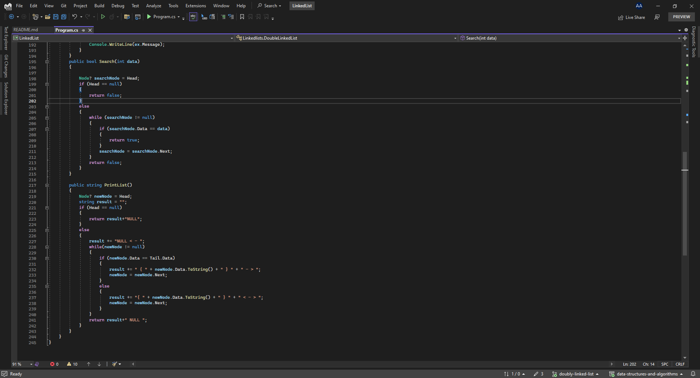

# Linked List CodeChallange 05

- ### Approach & Efficiency

    - What approach did you take? Why? What is the Big O space/time for this approach

        - I take a signle linked list approach to move from the head to the tail and created a class called node which has the data and 
        the next node to move from node to the next node, and the linked class has two node which is Head and the Head point to the first node in the linked list
        while the Tail point to the last node in linked list

        - the Big O Notation for the insertion is O(1) because i don't have any iteration, but for the print and the searching it is O(n) where n
        referes to how many time the while will iterate through my list and the space is O(1) for all things

- ### Solution

    - here are some screen shots for my code :camera:

    - 
    -  
    - 

    --- 

  # Strech Goal 

  - ### Approach & Efficiency

      -  What approach did you take? Why? What is the Big O space/time for this approach
          - I created a Double Linked List it looks like the single one but the different that the double linked list allow you to 
          move forward and backward so you can move in 2 ways for each node and that make the movitaion faster than the single linked list.

         - the Big O Notation the same of single linked list   for the insertions is O(1) because i don't have any iteration, but for the print and the searching it is O(n) where n
        referes to how many time the while will iterate through my list and the space is O(1) for all things.
       

- ### Solution 
- here are some screen shots for my code :camera:
    - 
    -  
        - 