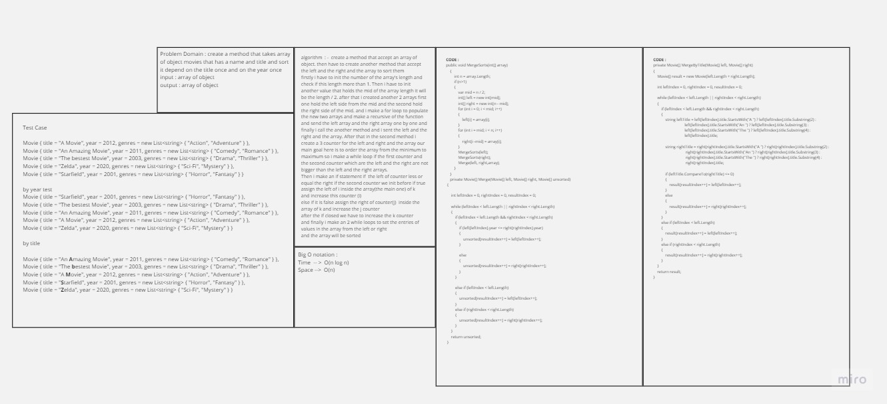
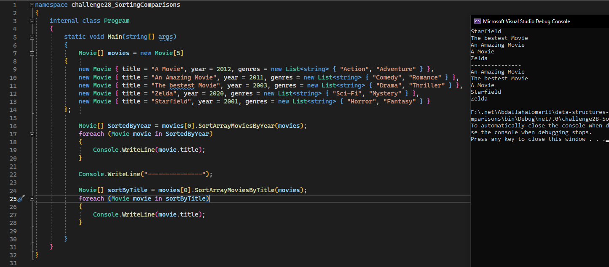
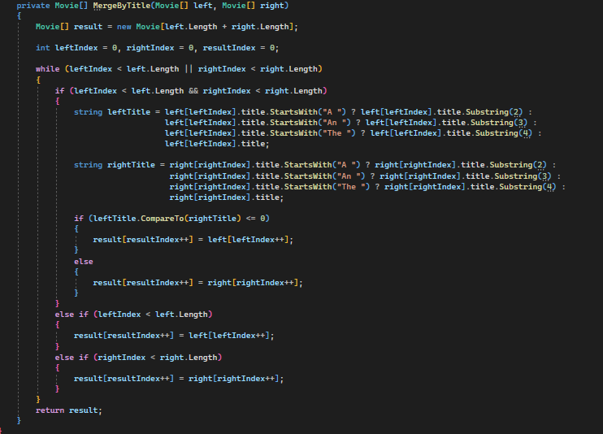
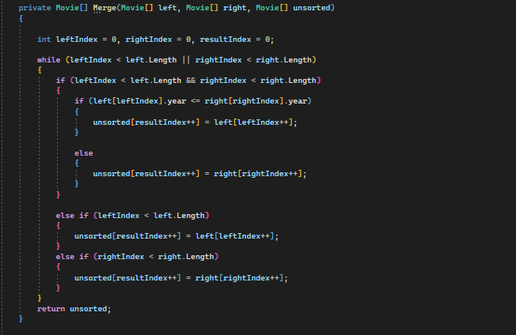

## Code Challange 28 Comparsion String 

- ### White Board 
    
    - 

- ### Approach and Efficiency:
    
    - **Sort by Year:**
        
        - Use A merge Sort Algorthim to sort the all objects depend on the year for each objcet it will divide and conqur them then it will merge each sub object 

        - Time complexity O(n logn)

        - space complexity O(n)

    - **Sort by Title:**

        - Use A merge Sort Algorthim to sort the all objects depend on the title for each object and by skipping the `A or An, The` on first of each movie title 

        - Time complexity O(n logn)

        - space complexity O(n)

- ### Code 

    - 
    - 
    - 